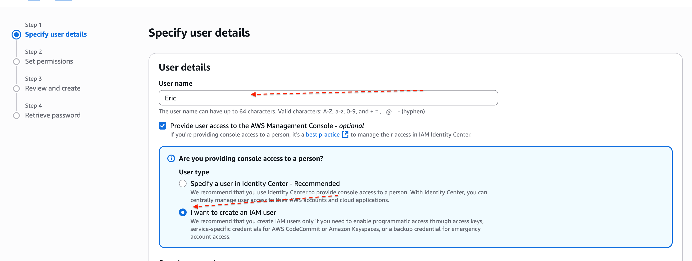

> # AWS_IAM

AWS Identity and Access Management Mini project 

Project Duration: 2 hours 
We're going to learn about AWS Identity and Access Management (IAM), which helps control who can access what in Amazon Web Services. We'll cover things like users, roles, policies, and groups, and we'll also show you how to actually set them up to keep your AWS resources safe. 
But before we get into all that, let's make sure you understand the basics of cloud computing. I terms like "Cloud" sound new to you, it's a good idea to go back and review some earlier materials to get a solid grasp of what it's all about. 
Project Goals : 
Understand AWS Identity and Access Management (IAM) principles and components. Learn to create and manage IAM policies for regulating access to AWS resources securely. Apply IAM concepts practically to control access within AWS environments. Explore best practices for IAM implementation and security in AWS. 

Learning Outcomes : 

Recognize IAM components like users, roles, policies, and groups. Create and manage IAM policies to define permissions for users and roles. Set up IAM users, groups, and roles to control access to AWS services. Understand IAM best practices for maintaining security and managing access to AWS 
resources. 
What is IAM? 
IAM, or Identity and Access Management. Think of it as the gatekeeper for your AWS resources its job is to decide who gets in and what they're allowed to do once they're inside. 
Imagine you have this big digital "house" full of all your AWS stuff—your data, your applications, the whole shebang. Now, you don't want just anyone wandering in and messing around with your things, right? That's where IAM steps in. 
It's like having your own VIP list for your digital world. IAM helps you keep your AWS resources safe and sound, making sure only the right people get in and that they're only allowed to do what you say they can. It's all about keeping your digital house in order and protecting your precious stuff from any unwanted guests. 

Note- AWS resources are the various services and tools provided by Amazon Web Services (AWS) that users can utilize to build and manage their applications and infrastructure in the cloud. 
> # What is IAM user? 
IAM users are like individual accounts for different people or entities within your AWS environment. 
For example, if you have a team working on a project, you can create separate IAM users for each team member. Each IAM user would have their own unique username and password, allowing them to access the AWS resources they need for their work. 
IAM users help you manage and control access to your AWS resources securely, ensuring that each user only has access to the resources they need to perform their tasks. 
> # What is IAM Role? 
An IAM role defines what someone or something (like an application or service) can do within your AWS account. Each role has a set of permissions that determine which actions it can perform and which AWS resources it can access. 

For example, you might have an "admin" role that gives full access to all resources, or a "developer" role that only allows access to certain services for building applications. 
Or if we take another example, imagine you have a visitor who needs temporary access to you house to fix something. Instead of giving them a permanent key (IAM user), you give them a temporary key (IAM role) that only works for a limited time and grants access to specific rooms (AWS resources). 
IAM roles are flexible and can be assumed by users, services, or applications as needed. They are commonly used for tasks such as granting permissions to AWS services, allowing cross-account access, or providing temporary access to external users. IAM roles enhance security and efficiency by providing controlled access to AWS resources without the need for permaner credentials. 
> # What is IAM Policy? 
An IAM policy is a set of rules that define what actions a role can take. These rules specify the permissions granted to the role. Think of a policy as a rulebook for the role. It outlines which actions are allowed and which are not, helping to ensure secure and controlled access to your AWS resources. 

For example, the rulebook might say that the "admin" key (IAM role or user) can open any door and perform any action within the house (AWS resources), while the "viewer" key (IAM role or user) can only open certain doors and look around, but not make any changes. 
IAM policies define the permissions granted to IAM roles and users, specifying which AWS resources they can access and what actions they can take. They are essential for maintaining security and controlling access to AWS resources, ensuring that only authorized actions are performed by users and roles within your AWS account. 
> # What is IAM group? 
IAM Groups are like collections of IAM users. Instead of managing permissions for each user individually, you can organize users into groups based on their roles or responsibilities. 
You can think IAM Groups as these neat little collections of users with similar roles or responsibilities. It's like putting everyone into teams based on their tasks. So, you might have a group for developers, another for administrators, and so on. So instead of setting permissions fc each person one by one, you set them up for the whole group at once. 
For example, let's say you have a development team working on a project. Instead of assigninc permissions to each developer one by one, you can create an IAM Group called "Developers" and add all the developers to that group. Then, you assign permissions to the group as a whole.

Best Practices: 
* Give only the permissions needed: Don't give more access than necessary.

 * Use roles instead of users: Roles are safer and can be used when needed. 
 
 
 * Review roles regularly: Remove unused roles to keep things tidy and secure. 
 
 * Add extra security with MFA: Use Multi-Factor Authentication for extra protection.
 
 * Use ready-made policies: They're safer and easier to use. Keep policies simple: Make separate policies for different tasks.
 
 * Keep track of changes: Keep a record of who changes what. 

* Test policies before using them: Make sure they work the way you want them to before applying them to real stuff. 

* Use descriptive names: Choose clear and descriptive names for IAM groups to facilitate understanding and management. 

* Enforce strong password policies: Encourage users to create strong passwords and implement expiration and complexity requirements. 

Note- (difference between users and roles) In AWS, users are like individual people with their own set of keys to access resources. These keys are permanent and tied to specific individuals. It's similar to having your own key to the front door of your house—it's always yours. 

On the other hand, roles in AWS are more like special keys that can be used by different peoplE or even programs. These keys provide temporary access and can be used by different users as I needed. Roles are like master keys that can be used by anyone who needs access to certain things temporarily. So, while users are tied to specific individuals, roles are more flexible and ca be shared among different users for specific tasks.

For MFA you can check Multi-Factor Authentication  (MFA) for IAM 

Hope you have understood all about IAM. Now come to the practical part. 

A growth marketing consultancy company called GatoGrowFast.com wants to give some access to their employee Eric, Jack and Ade to the Aws resources. Let's see how it is being setup. 

We'll do it in Two parts. In the first part of the practical, we'll create a policy granting full access to EC2. Then, we'll create a user named Eric and attach that policy to him. 

In the second part, we'll create a group and add two more users, Jack and Ade, to that group. Afterward, we'll create a policy for granting full access to EC2 and S3, and attach it to the group

> # PART-1 
* Navigate to AWS dashboard 

* Now on the IAM dashbord, navigate to the left sidebar anc click on the policies

a) From there, search ec2 and select "amazonEC2FULLACESS" from the list of policies 

b) proceed by clicking on "create policy" initiate the policy creation process

* Now select all EC2 actions

* Now create policy

* This the policy that we created

* Enter the desired username for the user 

a) Then select the option "provide user access to the AWS Management console" if access to the web-based console interface is required

b) proceed to set up a password for thr user.

c) check the box "user must create a new password at the next sign-in" if allowing user to change  the password upon login

*  Select "attach policy directy"  and navigate to filter customer  managed policies"

a) choose the policy you created named "policy_for_eric" 

* Ensure to save your details for future purpose 

> # NOW LETS COME TO PART 2

1. on the "user group" section enter a group name 

a) click on "create user group" 

b) then, proceed to the "user" section

* Then we create john user and ade 

* Then you will need to added the user to the Development-team-policy

* after all that we attach the policy so all user are assinged to their individual roles 

* The policy is now attached to the group granting full permission to ec2 and s3 for the group user 

